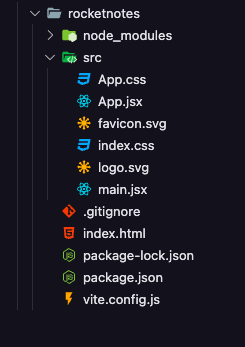
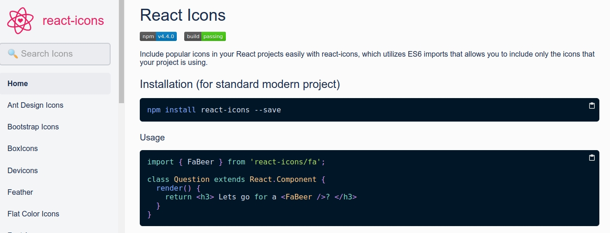

# Aplicação Frontend

- Abertura - 00:26 - Neste módulo aprenderemos a desenvolver aplicações Web utilizando ReactJS.

- O que é ReactJS - 01:40 - Nessa aula aprenderemos o que é o ReactJS e porque ele é chamado de biblioteca e o seu objetivo na programação Web.

 React JS é uma biblioteca JavaScript para a criação de interfaces de usuário — ou UI (user interface).

- Vite - 02:23 - Nessa aula aprenderemos o que é o Vite e qual a diferença dele entre o Create React App (CRA).
  [Vite](https://github.com/vitejs/vite) é uma ferramenta de construção para front-end. Ele fornece uma ferramenta de criação rápida e opinativa pronta para uso, com API altamente personalizável usando plug-ins.

- Criando projeto - 01:54 - Nessa aula aprenderemos a criar um projeto em React utilizando o Vite. Utilizando o seguinte comando: `npm create vite rocketnotes --template react`

  - `npm install`
  - `npm run dev`

- Estrutura de pastas e arquivos - 03:41 - Nessa aula aprenderemos a sobre a estrutura de pastas e arquivos dentro de um projeto ReactJS.
  

- Executando o projeto - 01:22 - Nessa aula aprenderemos o comando para execução do nosso projeto.

- Funcionamento do ReactJS - 06:30 - Nessa aula aprenderemos o funcionamento do ReactJS por baixo dos panos, como ele faz para renderizar arquivos `.jsx`

- JSX - 03:08 - Nessa aula aprenderemos como criar um componente e o que é o arquivo .jsx e sua estrutura.

- Fragment - 03:08 - Nessa aula aprenderemos o que é o Fragment no ReactJS.

- Adicionando CSS - 03:07 - Nessa aula aprenderemos a criar o arquivo .css e como organizar a estrutura para começarmos a estilizar o nosso projeto.

CSS in JS - 05:17 - essa aula aprenderemos o que é o styled components e como adicionar em nosso projeto. [styled-components](https://styled-components.com/)

- Instalar: `npm install --save styled-components`
- Instalar a extensão (Syntax highlighting for styled-components): [vscode-styled-components](https://marketplace.visualstudio.com/items?itemName=styled-components.vscode-styled-components)
- `ext install styled-components.vscode-styled-components`

- Tema - 05:03 - Nessa aula aprenderemos a criar temas globais para nosso projeto e importá-los para iniciarmos a estilização do mesmo

  - Figma - Rocket Notes: [RocketNotes](https://www.figma.com/file/PkV4fuIHaYcBHG7ZcfUXPX/RocketNotes?node-id=0%3A1)

  - Extensão: Highlight web colors in your editor [Color Highlight](https://marketplace.visualstudio.com/items?itemName=naumovs.color-highlight)
  - `ext install naumovs.color-highlight`

  ```js
  export default {
    COLORS: {
      BACKGROUND_900: "#232129",
      BACKGROUND_800: "#312E38",
      BACKGROUND_700: "#3E3B47",

      WHITE: "#F4EDE8",
      ORANGE: "#FF9000",

      GRAY_100: "#999591",
      GRAY_300: "#666360",

      RED: "#FF002E",
    },
  };
  ```

- Estilo Global - 06:40 - Nessa aula aprenderemos como criar um arquivo de estilização global para utilizarmos dentro do nosso projeto e com isso, o projeto já trará algumas configurações de estilos padronizadas.

- Fontes personalizados - 04:00 - Nessa aula aprenderemos como adicionar fontes personalizadas em nosso projeto utilizando o [Google Fonts](https://fonts.google.com/).

- Componente - 09:44 - Nessa aula aprenderemos o que é componentes no ReactJS e criaremos o nosso primeiro componente, o _<Button />_.
- extensão: Visual Studio Code plugin that autocompletes filenames [Path Intellisense](https://marketplace.visualstudio.com/items?itemName=christian-kohler.path-intellisense): `ext install christian-kohler.path-intellisense`

- Propriedade - 09:26 -0 Nessa aula aprenderemos sobre propriedades dos componentes no ReactJS. Informaremos propriedades diferentes para cada componente _<Button />_

---

# Desenvolvendo Aplicação

- Figma - Rocket Notes: [RocketNotes](https://www.figma.com/file/PkV4fuIHaYcBHG7ZcfUXPX/RocketNotes?node-id=0%3A1)

- Componente Header - 06:34 - Nessa aula faremos o nosso componente Header para começarmos reproduzir o nosso layout de acordo com o Figma.

- Imagem do usuário - 06:03 - Nessa aula continuaremos a estilização do nosso componente Header e também adicionaremos a imagem do usuário no cabeçalho da página.

- Ícones - 04:33 - Nessa aula aprenderemos a utilizar lib `react-icons` em nosso projeto.

  - [React Icons](https://react-icons.github.io/react-icons/)
  - Instalação: `npm install react-icons --save`
    

- Children - 09:11 - Nessa aula desenvolveremos o componente de sessão utilizando a propriedade _children_ do ReactJS para exibir dados em diferentes sessões.

- Componente Tag - 04:31 - Nessa aula faremos o componente `<Tag />` utilizando a mesma técnica da aula anterior para exibir os marcadores em nosso projeto.
  - Extensão: Automatically add HTML/XML close tag, same as Visual Studio IDE or Sublime Text [Auto Close Tag](https://marketplace.visualstudio.com/items?itemName=formulahendry.auto-close-tag)
- Componente ButtonText - 04:25 - Nessa aula faremos o componente `*<ButtonText />*` para reutilizá-lo em outras páginas do nosso projeto.

- Finalizando Detalhes - 09:15 - Nessa aula finalizaremos a página de detalhes do projeto adicionando botões e alguns outros elementos.

- Aplicando Grid na Home - 08:18 - Nessa aula daremos início a página Home utilizando `display: grid`

- Logotipo - 02:09 - Nessa aula faremos a estilização do logotipo do projeto seguindo o layout do Figma

- Filtros - 03:38 - Nessa aula faremos o menu de filtros do projeto destacando a em laranja a tag que estiver selecionada.

- Botão Criar Nota - 01:46 - Nessa aula faremos o botão Criar Nota utilizando react-icons

- Input - 08:55 - Nessa aula faremos o componente <Input/> adicionando os respectivos ícones onde for necessário.

- Componente de Notas - 11:26 - Nessa aula faremos o Componente Notas e finalizaremos a página Home.

- Entendendo o Map - 12:07
- Estrutura da SignIn - 02:16 - Nessa aula começaremos a montar a estrutura de Login do projeto.

- Formulário da SignIn - 07:33 - Nessa aula faremos o formulário de login utilizando o pacote de ícones `React Icons` e estilizaremos com `styled-components`

- Utilizando Imagens - 02:32 - Nessa aula adicionaremos o background na página de login do nosso projeto.

  - Link para download da imagem:[background.png](https://storage.googleapis.com/golden-wind/explorer/description-assets/nivel-09/background.png)

- Importação de Imagem - 03:53

- SignUp - 04:29 - Nessa aula reaproveitaremos a página de Login (SignIn) para desenvolveremos a página de Cadastrar (SignUp)

- Profile - 08:24 - Nessa aula faremos a página de perfil do nosso projeto contendo a foto e formulários para cadastrar nome, e-mail e senha.

- Avatar do usuário - 08:02 - Nessa aula faremos o componente de Avatar do usuário e o botão de upload de imagem para futuramente conseguirmos substituir o avatar.

- Interface New - 02:57 - Nessa aula faremos a estrutura para cadastrar novas notas em nosso projeto.

- Header da New - 02:47 - Nessa aula faremos o componente Header para ser exibido ao cadastrarmos novas notas.

- TextArea - 03:36 - Nessa aula faremos um novo componente do tipo TextArea para que o usuário consiga escrever várias linhas ao adicionar uma nova nota.

- Componente NoteItem - 04:22 - Nessa aula faremos um novo componente chamado NoteItem com a propriedade readonly

- Estilizando o NoteItem - 08:04 - Nessa aula faremos a estilização do componente criado na aula anterior, o NoteItem

- Finalizando o New - 03:48 - Nessa aula finalizaremos a página de criar nova nota adicionando as tags e o botão de salvar na interface.

- Rotas - 08:56 - Nessa aula utilizaremos a lib chamada React Router para fazermos as navegações funcionarem corretamente dentro do projeto.

  - [React Router: Declarative Routing for React](https://v5.reactrouter.com/web/guides/quick-start)

- Navegação - 07:01 - Nessa aula configuraremos as rotas para que a navegação funcione corretamente.

- Encerramento - 00:31
