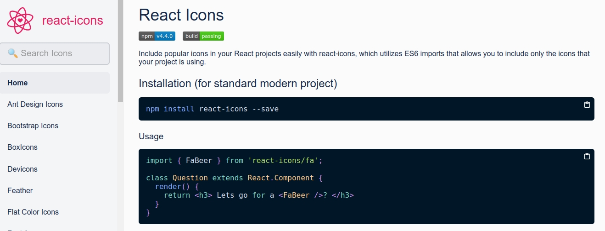

# Desenvolvendo Aplicação

- Figma - Rocket Notes: [RocketNotes](https://www.figma.com/file/PkV4fuIHaYcBHG7ZcfUXPX/RocketNotes?node-id=0%3A1)

- Componente Header - 06:34 - Nessa aula faremos o nosso componente Header para começarmos reproduzir o nosso layout de acordo com o Figma.

- Imagem do usuário - 06:03 - Nessa aula continuaremos a estilização do nosso componente Header e também adicionaremos a imagem do usuário no cabeçalho da página.

- Ícones - 04:33 - Nessa aula aprenderemos a utilizar lib `react-icons` em nosso projeto.

  - [React Icons](https://react-icons.github.io/react-icons/)
  - Instalação: `npm install react-icons --save`
    

- Children - 09:11 - Nessa aula desenvolveremos o componente de sessão utilizando a propriedade _children_ do ReactJS para exibir dados em diferentes sessões.

- Componente Tag - 04:31 - Nessa aula faremos o componente `<Tag />` utilizando a mesma técnica da aula anterior para exibir os marcadores em nosso projeto.
  - Extensão: Automatically add HTML/XML close tag, same as Visual Studio IDE or Sublime Text [Auto Close Tag](https://marketplace.visualstudio.com/items?itemName=formulahendry.auto-close-tag)
- Componente ButtonText - 04:25 - Nessa aula faremos o componente `*<ButtonText />*` para reutilizá-lo em outras páginas do nosso projeto.

- Finalizando Detalhes - 09:15 - Nessa aula finalizaremos a página de detalhes do projeto adicionando botões e alguns outros elementos.

- Aplicando Grid na Home - 08:18
- Logotipo - 02:09
- Filtros - 03:38
- Botão Criar Nota - 01:46
- Input - 08:55
- Componente de Notas - 10:00
- Estrutura da SignIn - 02:07
- Formulário da SignIn - 07:33
- Utilizando Imagens - 02:32
- SignUp - 04:38
- Profile - 08:27
- Avatar do usuário - 08:02
- Interface New - 02:49
- Header da New - 02:47
- TextArea - 03:36
- Componente NoteItem - 04:22
- Estilizando o NoteItem - 08:04
- Finalizando o New - 03:41
- Rotas - 08:56
- Navegação - 07:29
- Encerramento - 00:31
